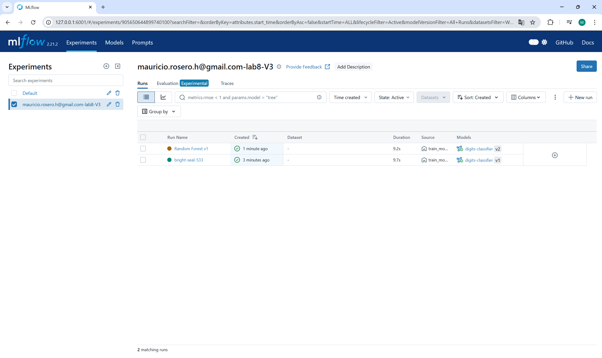

# Lab 8 - Manage ML Projects with MLFlow

## Deliverables

- [ ] Set up Local MLFlow Server and complete the `train_model.py` file. Show the registered model at [http://127.0.0.1:6001/#/models](http://127.0.0.1:6001/#/models)
- [ ] Complete `load_model.py`. Show uploaded experiment runs (on MLFlow web page) and the console output of running `load_model.py`
- [ ] Update the training pipeline and register a new version of the model in deliverable 1. Add a meaningful description or tag and explain your choice of classification model to the TA. (The model version number should be updated to 2 (or higher) to refect the change you've made on the UI)

**Screenshots:**

